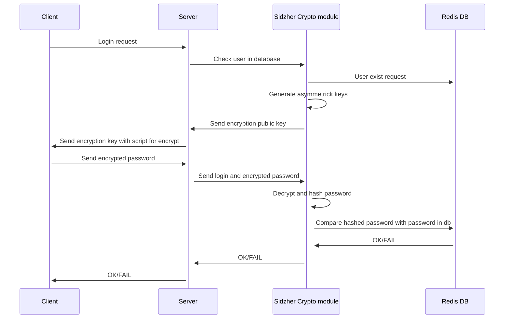

# SidZher project

### RU Краткое описание
Этот проект создан в рамках магистерской диссертации Сидориным Сергеем и Жердевым Александром, большая часть описания этой работы будет на английском языке, так как он является международным языком, диссертация посвящена авторизации и ауетентификации пользователя на веб-ресурсе при помощи ассиметричного шифрования. 

### EN Little description
This project was created as part of the master's thesis by Sidorin Sergey and Zherdev Alexander, most of the description of this work will be in English, since it is an international language, the dissertation is devoted to authorization and user authentication on a web resource using asymmetric encryption.


## How this works


## Transfer type between server and Sidzher Crypto

### We use json, struct here:

```json
{
  "step": 1,
  "req_type": "<type>",
  "user": "<user>",
  "data": ""
}

```

`step` is used for phased synchronization between the server and SidZher crypto module

`req_type` can be `auth` or `reg`, where:

- `auth` - Used for authentificate users
- `reg` - Used for register new users

`user` field used for users login name

`data` field used for transfer public key, encrypted data and answer for login

